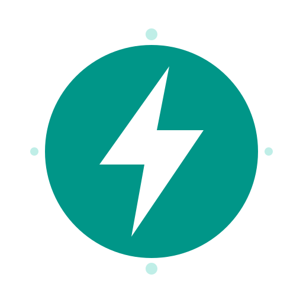
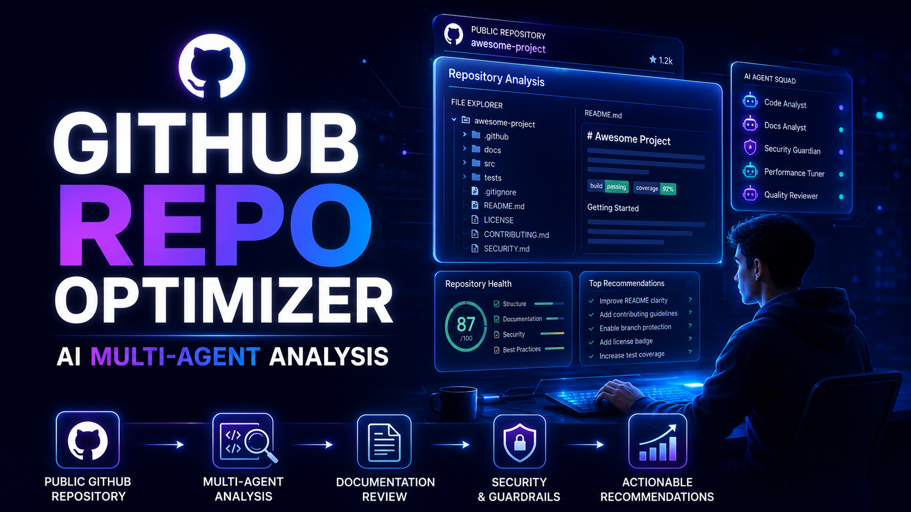
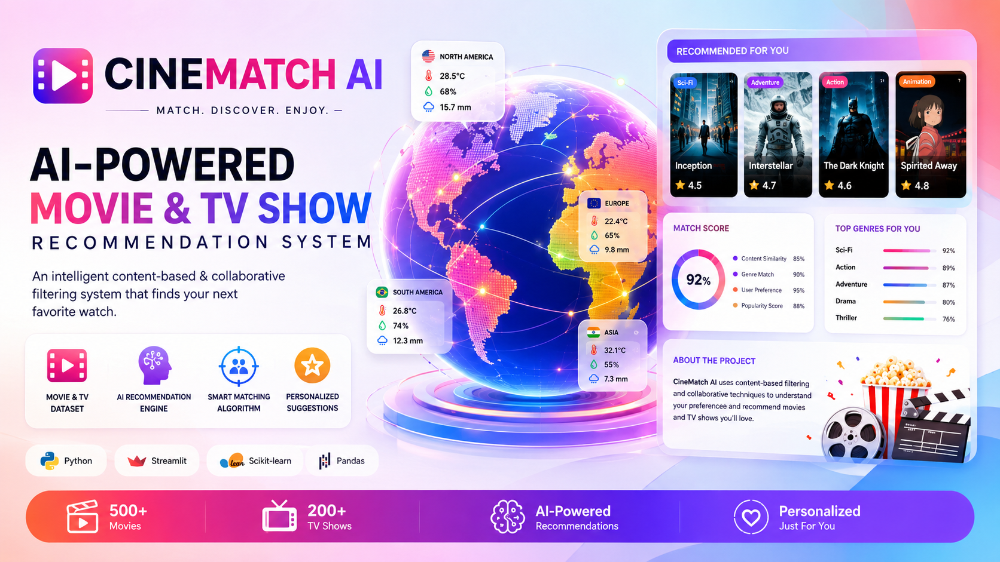
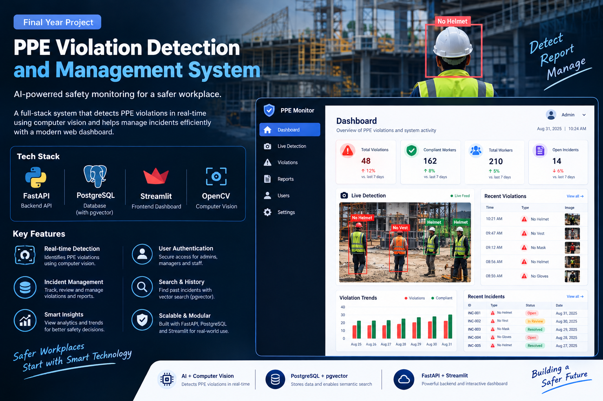

<!-- <p align="center">
  
</p> -->

<div align="center">

# Hi 👋, I'm Tehreem Irfan

#### Software Engineer · AI Systems Engineer · Agentic AI · Computer Vision · Backend Engineering

<a href="https://git.io/typing-svg">
  
</a>

</div>

<p align="center">
  I build production-grade intelligent systems that combine AI agents, computer vision,
  scalable backend services, automation, and modern software engineering.
</p>

<p align="center">
  <a href="https://www.linkedin.com/in/tehreem-irfan-8a3504274/">
    
  </a>
  <a href="mailto:tehreemirfan786@gmail.com">
    
  </a>
  <a href="https://portfolio-one-amber-idvr98xn6k.vercel.app/">
    
  </a>
</p>

---

<table>
<tr>

<td width="50%" valign="top">

## 👋 Who I Am

I'm **Tehreem Irfan**, an **Associate Software Engineer** and **Computer Science graduate** from Pakistan with a passion for engineering intelligent software that solves real-world problems.

My work focuses on building **production-grade AI systems** by combining **Agentic AI, Large Language Models, Computer Vision, scalable backend architecture, and workflow automation**. I enjoy designing software that is not only functional but also reliable, scalable, and ready for real-world use.

Currently, I'm expanding my expertise in **Multi-Agent AI, Model Context Protocol (MCP), Retrieval-Augmented Generation (RAG), advanced AI orchestration, and modern cloud-native architectures** while continuously building practical AI products.

I believe great software is built through continuous iteration:

**Learn → Design → Build → Test → Deploy → Improve → Share 🚀**

</td>

<td width="50%" valign="top">

## ⚡ Quick Info

```yaml
    Name:       Tehreem Irfan
    Role:       AI Systems Engineer

    Focus:
    • Agentic AI
    • Computer Vision
    • Backend Engineering

    Currently Learning:
    • Multi-Agent AI
    • MCP
    • Advanced RAG

    Languages:
    • Python
    • JavaScript
    • C++

    Stack:
    • FastAPI
    • PostgreSQL
    • Docker
```
</td> 
</tr> 
</table> 

---

## 🧰 Tech Stack

<div align="center">


&nbsp;&nbsp;

&nbsp;&nbsp;

&nbsp;&nbsp;

&nbsp;&nbsp;

</div>

<br>

<table align="center">
<tr>
<td align="right" width="200"><b>💻 Languages</b></td>
<td>


</td>
</tr>

<tr>
<td align="right"><b>🤖 AI Engineering</b></td>
<td>


</td>
</tr>

<tr>
<td align="right"><b>🧠 LLM & Agentic AI</b></td>
<td>

OpenAI • Claude • Gemini • LangChain • MCP • RAG • pgvector 

</td>
</tr>

<tr>
<td align="right"><b>⚡ Backend</b></td>
<td>


</td>
</tr>

<tr>
<td align="right"><b>🗄️ Databases</b></td>
<td>


</td>
</tr>

<tr>
<td align="right"><b>☁️ Cloud & DevOps</b></td>
<td>


</td>
</tr>

<tr>
<td align="right"><b>🎨 Frontend</b></td>
<td>


</td>
</tr>

<tr>
<td align="right"><b>🛠️ Tools</b></td>
<td>


&nbsp;

&nbsp;

&nbsp;
<a href="https://iconscout.com/icons/google-antigravity" class="text-underline font-size-sm"> </a> 

</td>
</tr>

</table>

---

## Featured Projects

## GitHub Repository Optimizer Agent

A production-oriented multi-agent AI system that analyzes public GitHub repositories and generates structured recommendations for documentation, engineering quality, security, discoverability, and portfolio readiness.

**Technologies:** Google ADK, Gemini, Python, GitHub API, Multi-Agent AI

<div align="center">
    
      <br>
      <strong align="center">
        GitHub Repository Optimizer <br>
        <a href="https://github.com/Tehreemirfan123/GitHub-Repository-Optimizer">
          View Repo
        </a>
      </strong>
</div>

---

## CineMatch AI

An intelligent movie and TV recommendation system using content-based and collaborative filtering to generate personalized viewing suggestions.

**Technologies:** Python, Scikit-learn, Pandas, Streamlit

<div align="center">
    
      <br>
      <strong align="center">
        GitHub Repository Optimizer <br>
        <a href="https://github.com/Tehreemirfan123/CineMatch-AI">
          View Repo
        </a>
      </strong>
</div>

---

### Real-Time PPE Compliance Monitoring System

A production-grade computer vision system for detecting and tracking PPE violations through real-time inference, backend APIs, database storage, and an operational dashboard.

**Highlights:** 44 FPS CPU-class inference, mAP@50 of 0.899, ONNX export, and OpenVINO optimization.

**Technologies:** YOLOv8/v11, PyTorch, FastAPI, PostgreSQL, pgvector, ByteTrack, OpenVINO, Docker, Streamlit

<div align="center">
  
      <br>
      <strong align="center">
        <a href="https://github.com/Tehreemirfan123/Real-Time_PPE_Compliance_Monitoring_System">
          View Repo
        </a>
      </strong>
</div>

---

### Agentic AI Sales Copilot

A multi-agent sales workflow combining research, outreach assistance, pre-call reporting, retrieval-augmented generation, and custom tools.

**Technologies:** Relevance AI, OpenAI API, RAG, Tool Calling, Prompt Engineering

---

## GitHub Analytics

<div align="center">
  
  
</div>

<br>

<p align="center">
  
</p>


<br>

<!-- <p align="center">
  
</p> -->

<div align="center">

> ### *"The best software doesn't just solve problems—it empowers people to solve bigger ones."*

</div>

---

## 📫 Let's Connect

<p align="center">
  <a href="https://www.linkedin.com/in/tehreem-irfan-8a3504274/">
    
  </a>
  <a href="mailto:tehreemirfan786@gmail.com">
    
  </a>
</p>

<p align="center">
  <i>Thanks for visiting my profile. Let's engineer intelligent systems that make a difference.</i>
  <br>
  <b>— Tehreem Irfan</b>
</p>
